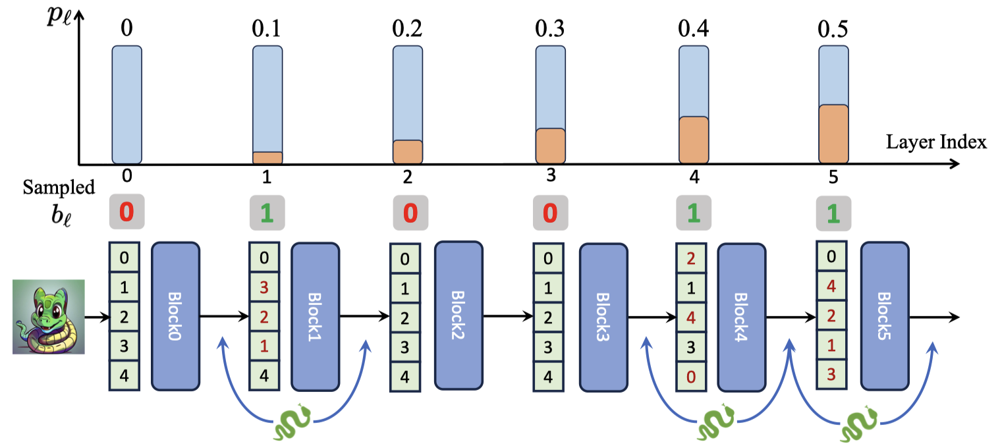

# Stochastic Layer-Wise Shuffle: A Good Practice to Improve Vision Mamba Training

#### Official PyTorch implementation of ShuffleMamba, a regularization for improving Vision Mamba training.

- #### Arxiv: https://arxiv.org/pdf/2408.17081



- #### Core Code for Stochastic Layer-Wise Shuffle [*plug and play*]:

  ```python
  def shuffle_forward(x, residual, layer: nn.Module, inference_params=None, prob: float = 0.0, training: bool = False):
      """
      Forward pass with optional shuffling of the sequence dimension.
  
      Args:
      - x (torch.Tensor): Input tensor with shape (B, L, d).
      - residual: Input tensor of the same size of x, required by mamba model
      - layer (nn.Module): A PyTorch module through which x should be passed.
      - prob (float): Probability of shuffling the sequence dimension L.
      - training (bool): Indicates whether the model is in training mode.
  
      Returns:
      - torch.Tensor: Output tensor from layer, with the sequence dimension
                      potentially shuffled and then restored.
      """
      
      B, L, _ = x.shape
      if training and torch.rand(1).item() < prob:
          # Generate a random permutation of indices
          shuffled_indices = torch.randperm(L, device=x.device).repeat(B, 1)
          # Get inverse indices by sorting the shuffled indices
          inverse_indices = torch.argsort(shuffled_indices, dim=1)
  
          # Apply the permutation to shuffle the sequence
          x_permuted = x.gather(1, shuffled_indices.unsqueeze(-1).expand(-1, -1, x.size(2)))
          if residual is not None:
              residual_permuted = residual.gather(1, shuffled_indices.unsqueeze(-1).expand(-1, -1, x.size(2)))
          else:
              residual_permuted = residual            
          
          # Forward pass through the layer
          output_permuted, residual_permuted = layer(x_permuted, residual_permuted, inference_params=inference_params)
          # Restore the original order
          output = output_permuted.gather(1, inverse_indices.unsqueeze(-1).expand(-1, -1, output_permuted.size(2)))
          residual = residual_permuted.gather(1, inverse_indices.unsqueeze(-1).expand(-1, -1, residual_permuted.size(2)))
      else:
          # Forward pass without shuffling
          output, residual = layer(x, residual, inference_params=inference_params)
  
      return output, residual
  ```

  

## Installation

### For ImageNet1K classification training
```shell
# torch>=2.0, cuda>=11.8
pip install timm==0.4.12 mlflow==2.9.1
pip install causal-conv1d==1.1.0
pip install mamba-ssm==1.1.1
```
### For ADE20K segmentation and COCO detection with Openmmlab tools
```shell
pip install mmengine==0.10.1 mmcv==2.1.0 opencv-python-headless ftfy regex
pip install mmdet==3.3.0 mmsegmentation==1.2.2 mmpretrain==1.2.0
```

## Training
Example for training the ShuffleMamba-B for 300 epochs: run the script `run.sh`.
Example for multi-stage training for ShuffleMamba-Reg-B: run the script `run_reg.sh`.
**all the models are training with 8 GPUs by default.*

## TO DO
- [ ] release the trained models
- [x] release the code

## Citation

```tex
@article{shufflemamba,
      title={Stochastic Layer-Wise Shuffle: A Good Practice to Improve Vision Mamba Training}, 
      author={Zizheng Huang and Haoxing Chen and Jiaqi Li and Jun Lan and Huijia Zhu and Weiqiang Wang and Limin Wang},
      journal={arXiv preprint arXiv:2408.17081},
      year={2024},
}
```

## Acknowledgement

This repo is built based on [Mamba-Reg](https://github.com/wangf3014/Mamba-Reg), [VideoMamba](https://github.com/OpenGVLab/VideoMamba/tree/main), [VMamba](https://github.com/MzeroMiko/VMamba/tree/main/detection) and [Vit-Adapter](https://github.com/czczup/ViT-Adapter), thanks!
